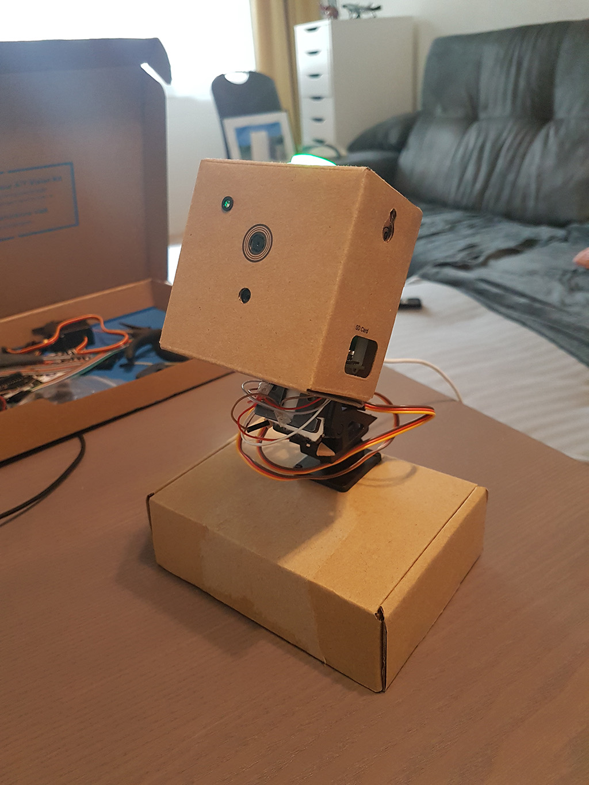
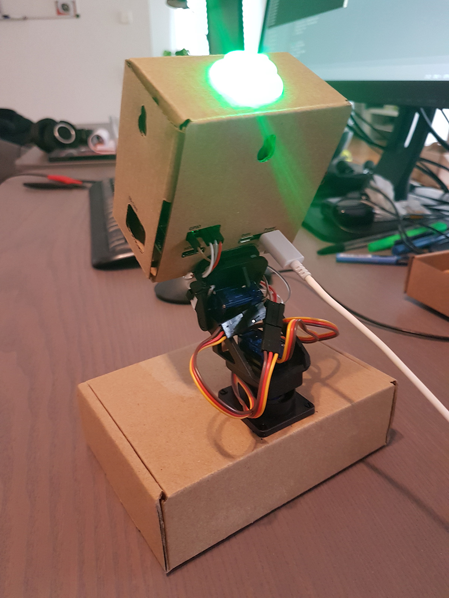

# Raspberry Pi Camera Follower

In this project, a [AIY Vision kit](https://aiyprojects.withgoogle.com/vision) is
mounted on top of a [Pan Tilt Hat](https://learn.pimoroni.com/tutorial/sandyj/assembling-pan-tilt-hat), and a Raspberry Pi detects and follow faces. This repo contains the python script controller.

 

## Usage

1. Mount the vision kit on the Pan Tilt Hat as shown in the picture.
1. Connect respectively the Yaw and Pitch servomotors to the PIN A and B of the Vision kit card.
1. Connect the ground and 5V of the servmotors to the card.
1. The Raspberry Pi, the vision kit and the two servomotors are together consuming more than the 500mA of a regular USB port. In my case, I had to use my 2A Samsung phone charger.
1. Switch on the Raspberry Pi.
1. When the Raspberry Pi is running, disable the startup demo with `sudo systemctl stop 
joy_detection_demo`.
1. Start the script with `python3 follower_main`.

## Behavior

The pan-tilt-hat keeps the camera facing any detected face. The color of led button varies from 
red to green depending on the smile of the face.

